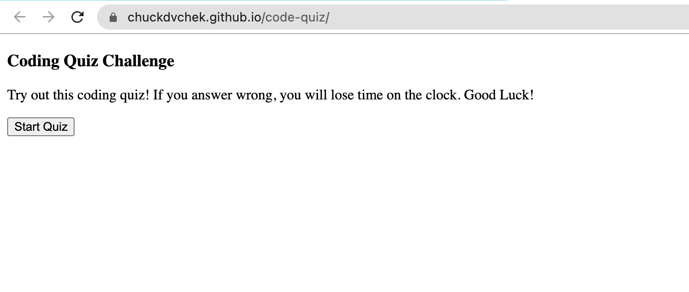

# code-quiz
## Description
- This website is a quiz that can have any length of questions with four available answers, to use the website:
    - Press "Start Quiz" to begin the quiz.
    - A timer will start counting down 45 seconds. If the time runs out, you will not be able to answer any following questions and be taken to your end score of zero.
    - If the user answers incorrectly, five seconds will be taken off of their time.
    - After answering all available questions, you will be prompted if you want to save the score to the scoreboard.
    - If you do want to save your score, you will be prompted to input your name and press 'yes'.
    - After hitting enter, your name and score will be put on the list of highscores.
    - You will be given the option to return to the start page and play again, or wipe all saved scores from the list.

## Live Site: 
https://chuckdvchek.github.io/code-quiz/
## Repository: 
https://github.com/ChuckDvchek/code-quiz

## Credits: 
Carsdan Dvorachek with the help of my teacher, teachers assistants, study group, and other classmates. 